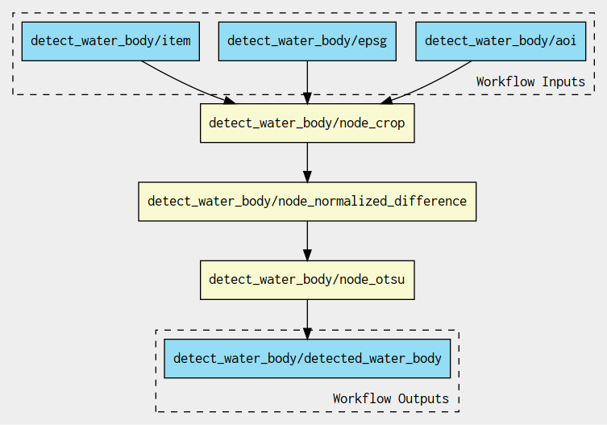

# Water bodies detection Application Package development and testing


**Alice implements the application package**


## Background 
This Application Package takes as input Copernicus Sentinel-2 data and detects water bodies by applying the *Otsu* thresholding technique on the Normalized Difference Water Index (NDWI).

The NDWI is calculated with: 

$$
NDWI = { (green - nir) \over (green + nir) } 
$$

Typically, NDWI values of water bodies are larger than 0.2 and built-up features have positive values between 0 and 0.2. Vegetation has much smaller NDWI values, which results in distinguishing vegetation from water bodies easier. 

The NDWI values correspond to the following ranges:

| Range       | Description                            |
| ----------- | -------------------------------------- |
| 0,2 - 1     | Water surface                          |
| 0.0 - 0,2   | Flooding, humidity                     |
| -0,3 - 0.0  | Moderate drought, non-aqueous surfaces |
| -1 - -0.3   | Drought, non-aqueous surfaces          |

To ease the determination of the water surface/non water surface, the Ostu thresholding technique is used. 

In the simplest form, the Otsu algorithm returns a single intensity threshold that separate pixels into two classes, foreground and background. This threshold is determined by minimizing intra-class intensity variance, or equivalently, by maximizing inter-class variance:


## Application Workflow
The Water Bodies detection steps are depicted below:


The application takes a list of Sentinel-2 STAC items references and then crops the radiometric bands `green` and `NIR` with a user-defined area of interest (AOI). Each cropped band is then used to calculate the `NDWI` and subsequently the Otsu threashold is applied to it, generating the water bodies output mask. The final step of the workflow consists on generating the STAC catalog and items for the generated results.

Alice organizes the Application Package to include a macro workflow that reads the list of Sentinel-2 STAC items references, the AOI and the EPSG code. The workflow steps include i) a sub-workflow for the detection of the water bodies and ii) a step to create the STAC catalog of the generated output product(s)


The sub-workflow applies the  `crop`, `Normalized difference`, `Otsu threshold` steps:



## Input Sentinel-2 acquisitions
The development and test dataset is made of two Sentinel-2 acquisitions:

| Acquisitions 	|Image 1                    	|Image 2                    	|
|--------------	|---------------------------	|---------------------------	|
| Date         	|2021-07-13                 	|2022-05-24                 	|
| URL          	| [S2B_10TFK_20210713_0_L2A](https://earth-search.aws.element84.com/v0/collections/sentinel-s2-l2a-cogs/items/S2B_10TFK_20210713_0_L2A) 	| [S2A_10TFK_20220524_0_L2A](https://earth-search.aws.element84.com/v0/collections/sentinel-s2-l2a-cogs/items/S2A_10TFK_20220524_0_L2A) 	|
| Quicklook    	|  	|  	|

## Environments creation

Each `Command Line Tool` step (`crop`, `Normalized difference`, `Otsu threshold` and `Create STAC`) runs a Python script in a dedicated environment / container. 
To generate the environments, open a new `Terminal` and execute the commands below (either one by one or all at once):

```
mamba create -c conda-forge -y -p /srv/conda/envs/env_crop  gdal click pystac 
mamba create -c conda-forge -y -p /srv/conda/envs/env_norm_diff click gdal  
mamba create -c conda-forge -y -p /srv/conda/envs/env_otsu gdal scikit-image click 
mamba create -c conda-forge -y -p /srv/conda/envs/env_stac click pystac python=3.9 pip && \
    /srv/conda/envs/env_stac/bin/pip install rio_stac
mamba clean --all -f -y
```

This configuration step takes around five minutes to complete.

## Application Package inspection

Open the `app-package.cwl` Application Package and familiarise yourself with its structure, to understand what's going on during execution:  

1. Inspect the main workflow which `id` is **`water_bodies`**: 
    1.1. What are the input parameters? *(stac_items, aoi, epsg)*
    1.2. What are the steps of this workflow? *(node_water_bodies, node_stac)* 
2. Inspect the workflow which `id` is **`detect_water_body`**:
    2.1. What are the steps of this workflow? *(node_crop, node_normalized_difference, node_otsu)*
3. Inspect each of the `CommandLineTool` of `id`: **`crop`**, **`norm_diff`**, **`otsu`** and **`stac`** 
    3.1. Inspect each of the `Dockerfile` 

## Application Package execution

The water bodies Application Package can be executed with: 

```
cwltool --no-container app-package.cwl#water_bodies params.yml > out.json
```

* `cwltool` is a Common Workflow Language runner. 
* The flag `--no-container` is used to instruct `cwltool` to use the local command-line tools instead of using the containers.
* `app-package.cwl#water_bodies` defines the CWL file to execute as well as the entry point after the `#` symbol. Here it's the `Workflow` with the id `water_bodies`.
* The file `params.yml` is used to define the input parameters. In this case, these are:
```
stac_items:
- "https://earth-search.aws.element84.com/v0/collections/sentinel-s2-l2a-cogs/items/S2B_10TFK_20210713_0_L2A"
- "https://earth-search.aws.element84.com/v0/collections/sentinel-s2-l2a-cogs/items/S2A_10TFK_20220524_0_L2A"

aoi: "-121.399,39.834,-120.74,40.472"
epsg: "EPSG:4326"
```
* `out.json` is used to store the execution logs 

The `cwltool` execution prints: 

```console
jovyan@d6b06a2ce3d5:/workspace/workshop/07_app_package/water-bodies$ cwltool --no-container app-package.cwl#water_bodies params.yml > out.json
INFO /srv/conda/envs/notebook/bin/cwltool 3.1.20221201130942
INFO Resolved 'app-package.cwl#water_bodies' to 'file:///home/jovyan/ogc-eo-application-package-hands-on/water-bodies/app-package.cwl#water_bodies'
INFO [workflow ] start
INFO [workflow ] starting step node_water_bodies
INFO [step node_water_bodies] start
INFO [workflow node_water_bodies] start
INFO [workflow node_water_bodies] starting step node_crop
INFO [step node_crop] start
INFO [job node_crop] /tmp/hgboee9w$ python \
    -m \
    app \
    --aoi \
    -121.399,39.834,-120.74,40.472 \
    --band \
    green \
    --epsg \
    EPSG:4326 \
    --input-item \
    https://earth-search.aws.element84.com/v0/collections/sentinel-s2-l2a-cogs/items/S2B_10TFK_20210713_0_L2A
INFO [job node_crop] Max memory used: 67MiB
INFO [job node_crop] completed success
...

...
INFO [workflow ] starting step node_stac
INFO [step node_stac] start
INFO [job node_stac] /tmp/l9b37lie$ python \
    -m \
    app \
    --input-item \
    https://earth-search.aws.element84.com/v0/collections/sentinel-s2-l2a-cogs/items/S2B_10TFK_20210713_0_L2A \
    --water-body \
    /tmp/3_ithdmj/stg6a24fafc-7f9f-498a-b0c8-259811c7c959/otsu.tif \
    --input-item \
    https://earth-search.aws.element84.com/v0/collections/sentinel-s2-l2a-cogs/items/S2A_10TFK_20220524_0_L2A \
    --water-body \
    /tmp/3_ithdmj/stg5a6afa0d-1926-4256-83f1-c5f7ba4edeab/otsu.tif
INFO [job node_stac] Max memory used: 47MiB
INFO [job node_stac] completed success
INFO [step node_stac] completed success
INFO [workflow ] completed success
INFO Final process status is success
```

## Result inspection

Once the workflow execution is completed, there's a folder, which name is a 8-character alphanumeric string, with the generated results.

The JSON file `out.json` is a manifest containing the listing of the results included in that folder:

```json
{
    "stac_catalog": {
        "location": "file:///home/jovyan/ogc-eo-application-package-hands-on/water-bodies/l9b37lie",
        "basename": "l9b37lie",
        "class": "Directory",
        "listing": [
            {
                "class": "Directory",
                "location": "file:///home/jovyan/ogc-eo-application-package-hands-on/water-bodies/l9b37lie/S2A_10TFK_20220524_0_L2A",
                "basename": "S2A_10TFK_20220524_0_L2A",
                "listing": [
                    {
                        "class": "File",
                        "location": "file:///home/jovyan/ogc-eo-application-package-hands-on/water-bodies/l9b37lie/S2A_10TFK_20220524_0_L2A/S2A_10TFK_20220524_0_L2A.json",
                        "basename": "S2A_10TFK_20220524_0_L2A.json",
                        "checksum": "sha1$de27e30c1e40ac0c2cb41f66f25e0258f4a6fdbc",
                        "size": 4870,
                        "path": "/home/jovyan/ogc-eo-application-package-hands-on/water-bodies/l9b37lie/S2A_10TFK_20220524_0_L2A/S2A_10TFK_20220524_0_L2A.json"
                    },
                    {
                        "class": "File",
                        "location": "file:///home/jovyan/ogc-eo-application-package-hands-on/water-bodies/l9b37lie/S2A_10TFK_20220524_0_L2A/otsu.tif",
                        "basename": "otsu.tif",
                        "checksum": "sha1$f8b7daf9c86b0271a813a0948e0edb947e5f2773",
                        "size": 175932,
                        "path": "/home/jovyan/ogc-eo-application-package-hands-on/water-bodies/l9b37lie/S2A_10TFK_20220524_0_L2A/otsu.tif"
                    }
                ],
                "path": "/home/jovyan/ogc-eo-application-package-hands-on/water-bodies/l9b37lie/S2A_10TFK_20220524_0_L2A"
            },
            {
                "class": "File",
                "location": "file:///home/jovyan/ogc-eo-application-package-hands-on/water-bodies/l9b37lie/catalog.json",
                "basename": "catalog.json",
                "checksum": "sha1$f7214df9b2be4df8b704b4bbe73cdf76b30b0ca6",
                "size": 525,
                "path": "/home/jovyan/ogc-eo-application-package-hands-on/water-bodies/l9b37lie/catalog.json"
            },
            {
                "class": "Directory",
                "location": "file:///home/jovyan/ogc-eo-application-package-hands-on/water-bodies/l9b37lie/S2B_10TFK_20210713_0_L2A",
                "basename": "S2B_10TFK_20210713_0_L2A",
                "listing": [
                    {
                        "class": "File",
                        "location": "file:///home/jovyan/ogc-eo-application-package-hands-on/water-bodies/l9b37lie/S2B_10TFK_20210713_0_L2A/S2B_10TFK_20210713_0_L2A.json",
                        "basename": "S2B_10TFK_20210713_0_L2A.json",
                        "checksum": "sha1$fe3860a19aabba59561d1410070e1a2378769b4a",
                        "size": 4870,
                        "path": "/home/jovyan/ogc-eo-application-package-hands-on/water-bodies/l9b37lie/S2B_10TFK_20210713_0_L2A/S2B_10TFK_20210713_0_L2A.json"
                    },
                    {
                        "class": "File",
                        "location": "file:///home/jovyan/ogc-eo-application-package-hands-on/water-bodies/l9b37lie/S2B_10TFK_20210713_0_L2A/otsu.tif",
                        "basename": "otsu.tif",
                        "checksum": "sha1$4bc4935a02b7de7d2460d05b3a3c4bf92557b8d3",
                        "size": 99746,
                        "path": "/home/jovyan/ogc-eo-application-package-hands-on/water-bodies/l9b37lie/S2B_10TFK_20210713_0_L2A/otsu.tif"
                    }
                ],
                "path": "/home/jovyan/ogc-eo-application-package-hands-on/water-bodies/l9b37lie/S2B_10TFK_20210713_0_L2A"
            }
        ],
        "path": "/home/jovyan/ogc-eo-application-package-hands-on/water-bodies/l9b37lie"
    }
}
```

The output files are saved in a new folder generated during the `cwltool` execution. Inside this directory, you will find: 
* `catalog.json` file 
* `S2A_10TFK_20220524_0_L2A` subdirectory, containing the output TIF water mask (`otsu.tif`) and its related STAC Item 
* `S2B_10TFK_20210713_0_L2A` subdirectory, containing the output TIF water mask (`otsu.tif`) and its related STAC Item

You can plot the output TIF with the last part of the `WaterBodies.ipynb` Jupyter Notebook, in which `pystac` is used to access the produced geotiffs files and then `leafmap` is used to plot them on the interactive map by a local tile server. 