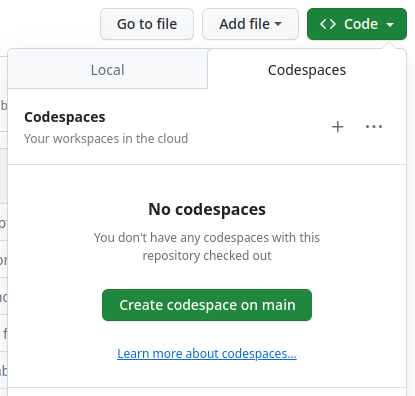
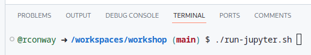
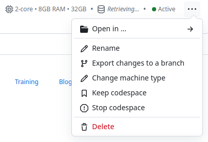

# EOEPCA Workshop - BiDS 2023

November 6th 2023

Workshop to demonstrate the capabilities of the EOEPCA building blocks.

## Agenda

* Introduction and Setup [10 mins]
* Data Discovery, Search and Transactions [15 mins]
* Services for Data Access and Visualisation [15 mins]
* User Workspace - data upload, registration and visualisation [15 mins]
* Application Package understanding, deployment and execution [35 mins]

## Participant Pre-requisites

**It is important that you establish any prerequisites identified here prior to the workshop.**

The workshop is conducted through a combination of:
* Jupyter Notebooks
* Presentation Slides
* OpenAPI Web Endpoints
* Web Applications

The Jupyter Notebooks are designed to be run locally be each participant. The notebook steps interface with the services of our EOEPCA Demo Cluster (demo.eoepca.org).

There are several approaches to invoke the JupyterLab environment to exploit the notebooks...
* **GitHub Codespace**<br>
  Instantiate a GitHub Codespace on the `workshop` repository, from which JupyterLab can be invoked. We have prepared a suitable Codespace to facilitate this.<br>
  **_This approaches requires no installation on your local PC, since it runs entirely within GitHub infrastructure, and relies only on your local browser_**
* **Pre-packaged Container Image**<br>
  Via our pre-prepared container image that includes JupyterLab and all necessary files<br>
  **_This approach requires docker running on your local PC and to download (pull) the workshop container image_**
* **Native JupyterLab**<br>
  Via JupyterLab running natively in your local environment<br>
  **_This approach requires an appropriate local Python (3.9) installation._**

We recommend either the `GitHub Codespace` or the `Pre-packaged Container Image` approach which place less dependency on the setup of your local PC. The `GitHub Codespace` approach places the least dependency on the setup of your local PC.

All required files are available in the [Workshop git repository](https://github.com/EOEPCA/workshop) at https://github.com/EOEPCA/workshop.

## Use GitHub Codespace

If you have a GitHub account then you can instantiate (60 hours free per month) a GitHub Codespace of the [`workshop` repository](https://github.com/EOEPCA/workshop).

We have pre-configured the repository with a Codespace specification that includes the required environment (Python 3.9) to run the JupyterLab Notebooks.

### Instantiate the Codespace

In a browser, login to GitHub and navigate to the [Workshop Repository](https://github.com/EOEPCA/workshop) page.

On the `Code` tab, select the `<>Code` button and switch to the `Codespaces` tab.<br>
Select to `Create codespace on main`...

<p align="center">
  
</p>

The Codespace will be created as a container running in GitHub - taking approx. one minute to instantiate.

The Codespace presents a code editor environment in the style of `vscode`.

### Run JupyterLab inside Codespace

At this point you have an environment that includes a Python (3.9) installation in which the workshop repo has already been cloned.

Within the Codespace, the `TERMINAL` can be used to follow the [Run JupyterLab in Native Python](#run-jupyterlab-in-native-python) instructions (below) to run JupyterLab...

<p align="center">
  
</p>

**The [running server](http://127.0.0.1:8888/lab) is available at the local address http://127.0.0.1:8888/lab.**

NOTE that the Codespace configures Port Forwarding to make the JupyterLab web application (running in GitHub) available via a local port.

### Delete Codespace

After the workshop you will want to delete your Codespace to avoid consuming unwanted resources.

Navigate to your [Codespace Management Page](https://github.com/codespaces) on GitHub (https://github.com/codespaces).

Identify the Codespace for the workshop and select its deletion...

<p align="center">
  
</p>

## Use Pre-packaged Container Image

Via our [pre-prepared container image](https://hub.docker.com/repository/docker/eoepca/workshop) that includes JupyterLab and all necessary files.

This approach relies upon a local installation of [Docker Engine](https://docs.docker.com/engine/).

Once docker is installed then you can pull the workshop container image...

**It is strongly advised to perform this step prior to the workshop - due to the size of the download.**

```
docker pull eoepca/workshop
```

The easiest way to use the workshop container image is via the run script in the repo (assumes bash)...

```
git clone https://github.com/EOEPCA/workshop
cd workshop
./run.sh
```

This script maps your local copy of the notebooks (cloned from the repo - in the sub-directory `workshop/notebooks/`) into the running container. This ensures that you are using the latest versions of the notebooks from the repo, rather than the ones included in the container image - and so mitigates the possibility of last minute changes to the notebooks being missing from your copy of the container image. In addition, it allows your notebook executions to be persisted locally outside of the container.

**The [running server](http://127.0.0.1:8888/lab) is available at the local address http://127.0.0.1:8888/lab.**

The script equates to the following `docker run` command...

```
docker run --rm --name jupyterlab \
  --user root \
  -p 8888:8888 \
  -v ${PWD}/workshop:/home/${NB_USER}/work \
  -e NB_USER="${NB_USER}" \
  -e NB_UID="${NB_UID}" \
  -e NB_GID="${NB_GID}" \
  -e CHOWN_HOME="yes" \
  -e JUPYTER_ENABLE_LAB="yes" \
  eoepca/workshop \
  start-notebook.sh --NotebookApp.token=\'\'
```

...where environment variables are set for the username (`NB_USER`), user ID (`NB_UID`) and group (`NB_GID`) - in order to map your local user permissions into the running container for file ownerships.

## Use Native JupyterLab

Via JupyterLab running natively in your local environment.

### Clone the Workshop Repo

This approach assumes you have **python 3.9** installed in your local platform. Some dependent modules are **known not to work with python 3.10+**.

Clone the workshop repo to your local environment...

```
git clone https://github.com/EOEPCA/workshop
cd workshop
```

### Run JupyterLab in Native Python

Run the helper script `run-jupyter.sh` to install JupyterLab and its dependencies into a virtual environment, and then invoke the `jupyter-lab` server.

```
./run-jupyter.sh
```

The script performs the following steps...

* Creates and activates a python virtual environment under the path `venv`
* Installs module `jupyterlab`
* Installs the workshop notebook module dependencies from `workshop/requirements.txt`
* Invokes the server via the command `jupyter-lab`, running on port `8888`

**The [running server](http://127.0.0.1:8888/lab) is available at the local address http://127.0.0.1:8888/lab.**
